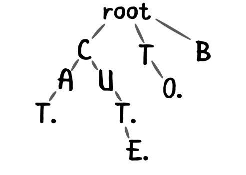

# Algoritmos e Estrutura de Dados 1 – Trabalho 4

## Trie

Uma trie(ou  árvore  de  prefixo) é  uma  estrutura  de  dados  do  tipo  árvore muito utilizada como dicionário ou como base para algoritmos de sugestão e auto complete em aplicações de teclado. 
Sua  estrutura  é  a  seguinte:   cada  nodo,  partindo  da  raiz,  contém  um ponteiro para cada letra do alfabeto considerado.  Uma palavra está inclusa na trie se houver um caminho, partindo da raiz, que passe por todas as letras da palavra.  Por exemplo, na trie abaixo, algumas das palavras consideradas inclusas seriam cat, to e cute.  A palavra cut também é considerada inclusa,mesmo que o seu final esteja em um nó interno, e não em uma folha.

## Implementação

A implementação incompleta de uma trie simples se encontra no arquivo tp4.c e vocês devem completar as seguintes funções:
1. bool inserenovo(Nodo * trie, char * palavra, int pos) : insere palavra a partir do caractere pos na trie. Retorna true se sucesso,false caso contrário.
2. bool insere(Nodo * trie, char * palavra, int pos) : procura posição para inserir palavra a partir do caractere pos na trie. Utilizar função inserenovo em conjunto com essa função. Retorna true se sucesso, false caso a palavra já esteja inserida ou caso falhe na inserção.
3. bool procura(Nodo * trie, char * palavra) : procura a palavra na trie.Retorna true se encontrou,false caso contrário. A implementação deve ser recursiva para todas as funções do trabalho

## Avaliação

Além disso, como nos trabalhos anteriores, código que não compila receberá nota zero, código que não liberar toda a memória alocada não receberá mais do que metade da nota, mesmo que o programa faça o que foi solicitado. Nota 10 é aquele trabalho que fez o solicitado e o fez de forma eficiente, ou seja, sem processamento e memória desnecessários para completar a tarefa. Além desses parâmetros, quando a resposta dada não estiver correta a avaliação tentará a identificar se estava na direção correta para assim atribuir uma nota intermediária que representa o quanto foi feito e o quanto de processamento e memória foi desperdiçado.
